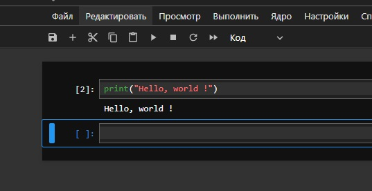
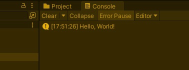
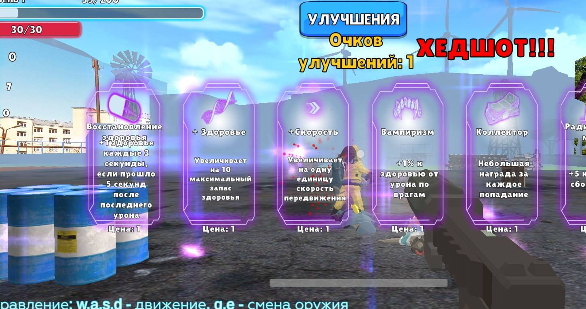

# АНАЛИЗ ДАННЫХ И ИСКУССТВЕННЫЙ ИНТЕЛЛЕКТ [AD in GameDev]
Отчет по *Лабораторной работе №1* выполнил:
- Крюков Никита Андреевич
- РИ-230915

| Задание | Выполнение | Баллы |
| ------ | ------ | ------ |
| Задание 1 | * | ? |
| Задание 2 | * | ? |
| Задание 3 | * | ? | 

Работу проверили:
- к.т.н., доцент Денисов Д.В.
- к.э.н., доцент Панов М.А.
- ст. преп., Фадеев В.О.

## Цель работы
Установить необходимое программное обеспечение, которое пригодится для создания интеллектуальных моделей на Python. Рассмотреть процесс установки игрового движка Unity для разработки игр.

## Задание 1
### Написать программу "Hello World!" на Python с запуском в Jupiter Notebook.
Ход работы:
- По инструкции устанавливаем Anaconda Navigator (у меня уже установлен и я умею им пользоваться).

- Для удобства создаём окружение, в котором будем работать. Открываем Jupiter Notebook и создаём блокнот [test_1.ipynb](https://github.com/ytkinroman/urfu_1/blob/main/jupiter_project/test_1.ipynb). В ячейке блокнота пишем код:

```py

print("Hello World!")

```

- Запускаем ячейку, наслаждаемся результатом:



## Задание 2
### Написать программу "Hello World!" на C# с запуском на Unity. 
Ход работы:
- Открываем Unity и создаём 3D проект.

- По стандарту у нас уже открывается готовая шаблонная сцена. В окне иерархии создаём пустой объект (CreateEmpty) на сцене. Для удобности переименуем его в HelloObject.

- Создаём папку Scipts и добавляем туда скрипт [HelloWorld.cs](https://github.com/ytkinroman/urfu_1/blob/main/Assets/Scripts/HelloWorld.cs), в котором пишем простую программу, которая будет приветствовать игрока в консоли при старте игры:

```cpp

using UnityEngine;

public class HelloWorld : MonoBehaviour
{
    private void Start()
    {
        Debug.Log("Hello, World!");
    }
}

```

- Скрипт вешаем на HelloObject. Запускаем сцену и радуемся результату:




## Задание 3
### Оформить отчет в виде документации на github (markdown-разметка).
Ход работы:
- Зарегистрироваться на github (у меня уже есть github и я умею им пользоваться).

- Создаём репозиторий, инициализируем файл README.md при создании репозитория.

- Загружаем дополнительные файлы в репозиторий, чтобы преподаватель оценил какой ты молодец. Заполняем отчёт в README.md согласно шаблону. Делаем финальный коммит и пуш. Радуемся результату.


## Задание 4 (Секретное)
### SaveRTF
Для создания более качественного игрового опыта с использованием ML-Agent, можно добавить интерактивных NPC, таких как голуби. Голуби будут смотреть, как дела у игрока и если совсем безысходная ситуация, то могут приносить игроку патроны.


## Выводы
В ходе выполнения работы были достигнуты некоторые цели:
- Установлено необходимое программное обеспечение (Anaconda Navigator) для создания интеллектуальных моделей на Python, а также среда разработки Jupyter Notebook.
- Рассмотрен процесс установки игрового движка Unity для разработки игр. Были выполнены все необходимые шаги для установки Unity, включая загрузку и установку самого движка, а также настройку рабочей среды для разработки игр.

В результате выполненной работы были созданы все необходимые комфортные условия для дальнейшей разработки интеллектуальных моделей на Python и создания игр с использованием Unity. Это позволит мне в будущем эффективно использовать данные инструменты для решения задач в области машинного обучения и игровой разработки.

Буду ждать комментариев по поводу моего отчёта, хорошего Вам дня !


